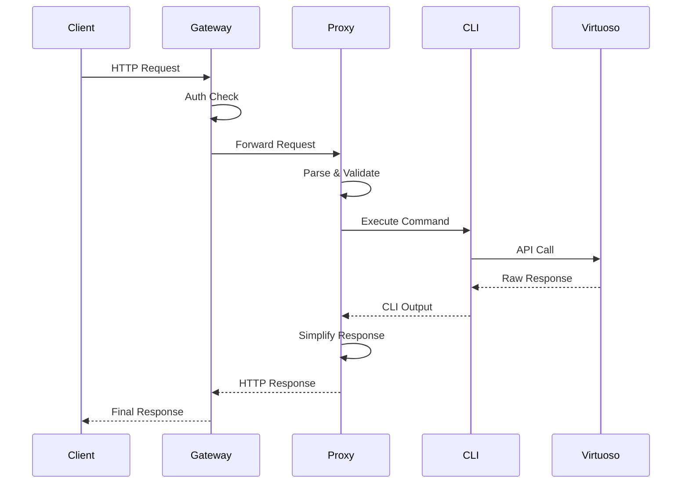

# Virtuoso API Proxy - System Architecture

## Overview

The Virtuoso API Proxy is a multi-deployment platform that simplifies access to the Virtuoso test automation API. It provides a unified interface across three deployment targets: AWS Lambda, Google Cloud Platform, and containerized environments.

## System Architecture

### High-Level Architecture

```
┌─────────────────────────────────────────────────────────────────┐
│                         Client Applications                      │
│        (Web Apps, CI/CD, CLI Tools, Mobile Apps)               │
└───────────────┬─────────────────────────────┬──────────────────┘
                │                             │
                ▼                             ▼
┌───────────────────────────┐ ┌──────────────────────────────────┐
│      API Gateway          │ │         Load Balancer            │
│  (AWS API GW / GCP LB)    │ │     (Cloud-specific or K8s)     │
└─────────────┬─────────────┘ └────────────────┬─────────────────┘
              │                                 │
              ▼                                 ▼
┌─────────────────────────────────────────────────────────────────┐
│                    API Proxy Layer                               │
├─────────────────────┬────────────────┬──────────────────────────┤
│   AWS Lambda       │  GCP Cloud Run  │   FastAPI Container      │
│   (Serverless)     │  (Serverless)   │   (Containerized)        │
└─────────────────────┴────────────────┴──────────────────────────┘
                              │
                              ▼
┌─────────────────────────────────────────────────────────────────┐
│                    Core Business Logic                           │
│  - Command Parsing   - Session Management   - Error Handling    │
│  - Request Mapping   - Response Formatting  - Validation        │
└─────────────────────────────────────────────────────────────────┘
                              │
                              ▼
┌─────────────────────────────────────────────────────────────────┐
│                     CLI Executor Layer                           │
│              Go Binary (api-cli) - 69+ Commands                  │
└─────────────────────────────────────────────────────────────────┘
                              │
                              ▼
┌─────────────────────────────────────────────────────────────────┐
│                    Virtuoso External API                         │
│               https://api-app2.virtuoso.qa/api                   │
└─────────────────────────────────────────────────────────────────┘
```

## Component Architecture

### 1. API Gateway Layer

#### AWS Implementation
```typescript
// AWS HTTP API Gateway with Lambda Integration
const api = new HttpApi(stack, 'VirtuosoApi', {
  apiName: 'virtuoso-api',
  corsPreflight: {
    allowOrigins: ['*'],
    allowMethods: [HttpMethod.ANY],
    allowHeaders: ['*']
  }
});

// Custom Authorizer
const authorizer = new HttpLambdaAuthorizer('Authorizer', authLambda, {
  responseTypes: [HttpLambdaResponseType.SIMPLE],
  identitySource: ['$request.header.Authorization'],
  resultsCacheTtl: Duration.minutes(5)
});
```

#### GCP Implementation
```yaml
# Cloud Run Service Configuration
apiVersion: serving.knative.dev/v1
kind: Service
spec:
  template:
    spec:
      containers:
        - image: gcr.io/project/virtuoso-api
          resources:
            limits:
              cpu: "1"
              memory: 512Mi
```

#### Local/Container Implementation
```python
# FastAPI Application
app = FastAPI(
    title="Virtuoso API Proxy",
    version="1.0.0",
    docs_url="/docs",
    redoc_url="/redoc"
)

@app.middleware("http")
async def add_security_headers(request: Request, call_next):
    response = await call_next(request)
    response.headers["X-Content-Type-Options"] = "nosniff"
    response.headers["X-Frame-Options"] = "DENY"
    return response
```

### 2. Core Business Logic

#### Command Processing Pipeline
```
Request → Validation → Parsing → Execution → Response Formatting
   │          │           │          │              │
   ▼          ▼           ▼          ▼              ▼
[Input]  [Schema]    [Parser]   [CLI Call]    [Simplify]
```

#### Session Management Architecture
```go
type SessionManager struct {
    store     SessionStore
    timeout   time.Duration
    maxActive int
}

type Session struct {
    ID           string
    CheckpointID string
    CreatedAt    time.Time
    LastActive   time.Time
    Metadata     map[string]interface{}
}
```

### 3. CLI Executor Architecture

#### Command Structure
```go
// Base command interface
type Command interface {
    Execute(ctx context.Context, args []string) (*Response, error)
    Validate(args []string) error
    GetHelp() string
}

// Command registry pattern
var commandRegistry = map[string]Command{
    "step-navigate":     &NavigateCommand{},
    "step-click":        &ClickCommand{},
    "step-write":        &WriteCommand{},
    // ... 66 more commands
}
```

#### YAML Processing Layer
```yaml
# Multi-format support architecture
Format Detection → Normalization → Validation → Compilation → Execution
       │                │              │            │            │
       ▼                ▼              ▼            ▼            ▼
[Detector]      [Normalizer]    [Validator]  [Compiler]    [Runner]
```

## Data Architecture

### 1. Request/Response Flow



### 2. Data Models

#### Simplified API Models
```typescript
// Original Virtuoso Request (Complex)
interface VirtuosoExecuteRequest {
  goalId: string;
  startingUrl?: string;
  includeDataDrivenJourneys?: boolean;
  includeDisabledJourneys?: boolean;
  parallelExecution?: boolean;
  maxParallelExecutions?: number;
  environment?: string;
  initialData?: Record<string, any>;
  headers?: Record<string, string>;
  cookies?: Cookie[];
  // ... 20+ more fields
}

// Simplified Proxy Request
interface ProxyExecuteRequest {
  startingUrl?: string;  // Everything else uses defaults
}

// Simplified Response
interface ProxyExecuteResponse {
  jobId: string;
  status: 'started' | 'queued' | 'failed';
  message?: string;
}
```

### 3. Storage Architecture

#### AWS Storage
- **Secrets Manager**: API keys and credentials
- **CloudWatch Logs**: Execution logs and metrics
- **S3**: Test artifacts and reports (optional)

#### GCP Storage
- **Secret Manager**: Credentials
- **Firestore**: Session data, cache
- **Cloud Storage**: Test artifacts
- **BigQuery**: Analytics and logs

#### Local Storage
- **Environment Variables**: Configuration
- **Redis**: Session cache (optional)
- **Local Filesystem**: Temporary files

## Security Architecture

### 1. Authentication & Authorization

```
┌─────────────────────────────────────────────────┐
│              Security Layers                     │
├─────────────────────────────────────────────────┤
│  1. API Gateway: Rate limiting, DDoS protection │
│  2. Authorizer: Bearer token validation         │
│  3. Application: Input validation, sanitization │
│  4. CLI: Credential isolation                   │
│  5. Network: TLS encryption, VPC isolation      │
└─────────────────────────────────────────────────┘
```

### 2. Secret Management

```yaml
# Hierarchical secret structure
/virtuoso
  /api
    /keys
      /primary: "encrypted-api-key"
      /secondary: "encrypted-backup-key"
    /config
      /org_id: "2242"
      /base_url: "https://api-app2.virtuoso.qa/api"
  /auth
    /tokens
      /service: "service-account-token"
```

## Deployment Architecture

### 1. Multi-Cloud Deployment Strategy

```
                    ┌─────────────────┐
                    │   DNS (Route53) │
                    │  api.domain.com │
                    └────────┬────────┘
                             │
                ┌────────────┴────────────┐
                │                         │
        ┌───────▼────────┐      ┌────────▼────────┐
        │  AWS Region    │      │  GCP Region     │
        │  us-east-1     │      │  us-central1    │
        ├────────────────┤      ├─────────────────┤
        │ • API Gateway  │      │ • Cloud Run     │
        │ • Lambda       │      │ • Firestore     │
        │ • Secrets Mgr  │      │ • Cloud Tasks   │
        └────────────────┘      └─────────────────┘
                │                         │
                └───────────┬─────────────┘
                            │
                    ┌───────▼────────┐
                    │   Failover     │
                    │   Logic        │
                    └────────────────┘
```

### 2. Container Architecture

```dockerfile
# Multi-stage build for optimization
FROM golang:1.24 AS cli-builder
WORKDIR /build
COPY . .
RUN make build-linux

FROM python:3.11-slim AS api
WORKDIR /app
COPY --from=cli-builder /build/bin/api-cli /usr/local/bin/
COPY api/requirements.txt .
RUN pip install -r requirements.txt
COPY api/ .
CMD ["uvicorn", "app.main:app", "--host", "0.0.0.0"]
```

### 3. Kubernetes Architecture

```yaml
apiVersion: apps/v1
kind: Deployment
metadata:
  name: virtuoso-api
spec:
  replicas: 3
  selector:
    matchLabels:
      app: virtuoso-api
  template:
    spec:
      containers:
      - name: api
        image: virtuoso-api:latest
        resources:
          requests:
            memory: "256Mi"
            cpu: "100m"
          limits:
            memory: "512Mi"
            cpu: "500m"
        livenessProbe:
          httpGet:
            path: /health
            port: 8000
        readinessProbe:
          httpGet:
            path: /health/ready
            port: 8000
```

## Performance Architecture

### 1. Caching Strategy

```
┌─────────────────┐     ┌─────────────────┐     ┌─────────────────┐
│  CDN Cache      │────▶│  API Gateway    │────▶│  Application    │
│  (CloudFront)   │     │  Cache          │     │  Cache          │
│  - Static assets│     │  - GET requests │     │  - Session data │
│  - Public APIs  │     │  - 5 min TTL    │     │  - CLI results  │
└─────────────────┘     └─────────────────┘     └─────────────────┘
```

### 2. Scaling Architecture

#### Horizontal Scaling
- **AWS**: Lambda auto-scaling (0-1000 concurrent)
- **GCP**: Cloud Run auto-scaling (0-100 instances)
- **K8s**: HPA based on CPU/memory/custom metrics

#### Vertical Scaling
- Memory: 256MB → 3GB based on workload
- CPU: 0.25 vCPU → 2 vCPU based on complexity
- Timeout: 30s default, 300s for long operations

## Monitoring Architecture

### 1. Observability Stack

```
┌──────────────┐     ┌──────────────┐     ┌──────────────┐
│   Metrics    │     │   Logging    │     │   Tracing    │
├──────────────┤     ├──────────────┤     ├──────────────┤
│ Prometheus/  │     │ CloudWatch/  │     │ X-Ray/       │
│ Cloud        │     │ Cloud        │     │ Cloud Trace  │
│ Monitoring   │     │ Logging      │     │              │
└──────┬───────┘     └──────┬───────┘     └──────┬───────┘
        │                    │                    │
        └────────────────────┴────────────────────┘
                             │
                    ┌────────▼────────┐
                    │   Grafana/      │
                    │   Dashboards    │
                    └─────────────────┘
```

### 2. Key Metrics

| Metric | Target | Alert Threshold |
|--------|--------|-----------------|
| API Latency (p95) | <200ms | >500ms |
| Error Rate | <1% | >5% |
| CPU Usage | <60% | >80% |
| Memory Usage | <70% | >85% |
| Request Rate | - | >1000 RPS |

## Disaster Recovery Architecture

### 1. Backup Strategy
- **Configuration**: Version controlled in Git
- **Secrets**: Automated backup with rotation
- **Data**: Cross-region replication
- **Code**: Multi-repository redundancy

### 2. Recovery Procedures
```
RTO (Recovery Time Objective): 15 minutes
RPO (Recovery Point Objective): 1 hour

Recovery Priority:
1. API Gateway restoration
2. Core service deployment
3. Session data recovery
4. Historical data restoration
```

## Future Architecture Considerations

### 1. Microservices Evolution
```
Current: Monolithic Proxy
Future: Decomposed Services
- Command Service
- Session Service
- Analytics Service
- Webhook Service
```

### 2. Event-Driven Architecture
```
Command Execution → Event Bus → Multiple Consumers
                         │
                         ├─→ Analytics Pipeline
                         ├─→ Webhook Dispatcher
                         ├─→ Audit Logger
                         └─→ Real-time Updates
```

### 3. Edge Computing
```
Global Edge Locations → Regional Clusters → Origin
     (Cache/Simple)        (Complex)       (Source)
```

---

*This architecture document represents the current state and planned evolution of the Virtuoso API Proxy system.*