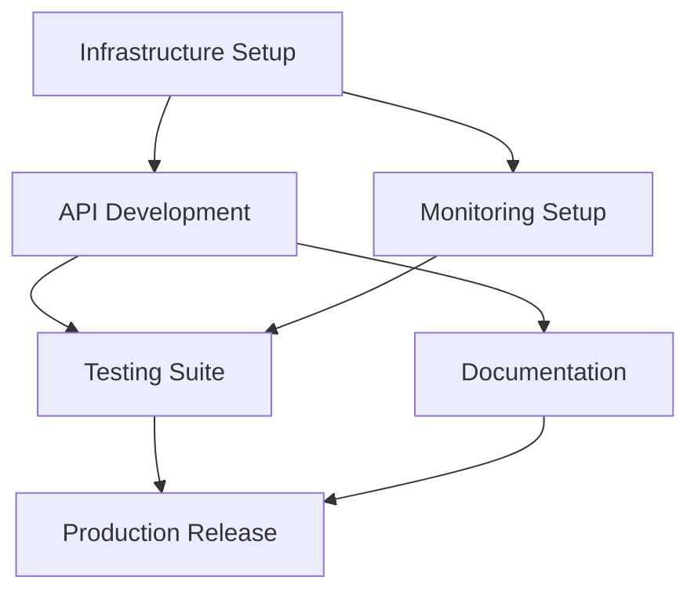

# Implementation Plan - Phase 1: Platform Consolidation

## Overview
This phase focuses on consolidating the multi-deployment architecture into a primary platform deployment while maintaining the ability to expand to other platforms in the future. Based on analysis, GCP is recommended as the primary platform due to simpler permissions, better free tier, and integrated services.

## Success Criteria
- [ ] Single production deployment operational
- [ ] All 69 CLI commands accessible via API
- [ ] Comprehensive monitoring and alerting
- [ ] Security hardening complete
- [ ] Documentation and onboarding process ready
- [ ] Cost optimization achieved (<$100/month for development)

## Architecture Decisions

### 1. Primary Platform: Google Cloud Platform
**Rationale**: 
- Simpler IAM model vs AWS
- Better free tier offerings
- Integrated services (Firestore, Cloud Run, etc.)
- Existing working implementation
- Lower operational complexity

### 2. API Standardization: REST + OpenAPI 3.0
**Rationale**:
- Industry standard
- Excellent tooling support
- Auto-generated documentation
- Client SDK generation
- GraphQL to be added in Phase 2

### 3. Deployment Strategy: Cloud Run + Firestore
**Rationale**:
- Serverless scaling (0 to N)
- Container-based flexibility
- Integrated with GCP services
- Cost-effective for variable loads

## Task Breakdown

### Team A Tasks: Infrastructure & Deployment
1. **Finalize GCP Infrastructure**
   - Review and optimize Terraform configurations
   - Implement multi-environment support (dev/staging/prod)
   - Set up automated backups
   - Configure SSL certificates and custom domain
   
2. **CI/CD Pipeline Setup**
   - Configure Cloud Build triggers
   - Implement blue-green deployment
   - Add smoke tests post-deployment
   - Set up rollback procedures

3. **Monitoring & Alerting**
   - Configure Cloud Monitoring dashboards
   - Set up PagerDuty integration
   - Implement SLO/SLA monitoring
   - Create runbooks for common issues

### Team B Tasks: API Development & Security
1. **API Gateway Enhancements**
   - Implement request/response validation
   - Add comprehensive error handling
   - Create middleware for logging/tracing
   - Implement request deduplication

2. **Security Hardening**
   - Implement rate limiting per API key
   - Add request signing/verification
   - Set up WAF rules in Cloud Armor
   - Implement API key rotation mechanism

3. **Authentication & Authorization**
   - Enhance API key management
   - Add JWT token support
   - Implement RBAC foundation
   - Create admin API endpoints

### Team C Tasks: Testing & Documentation
1. **Comprehensive Testing Suite**
   - Unit tests for all endpoints (>80% coverage)
   - Integration tests with mock Virtuoso API
   - Load testing with k6/Locust
   - Security testing with OWASP ZAP

2. **Documentation Portal**
   - Generate OpenAPI documentation
   - Create getting started guide
   - Write API cookbook with examples
   - Set up documentation versioning

3. **Developer Experience**
   - Create CLI for API interaction
   - Build Postman collection
   - Generate client SDKs (Python, JS, Go)
   - Create interactive API playground

## Dependencies

### Cross-Team Dependencies

### External Dependencies
1. **GCP Project Setup**: Billing account, APIs enabled
2. **Domain Configuration**: DNS records, SSL certificates
3. **Virtuoso API Access**: Valid API keys, rate limits understood
4. **Security Review**: Penetration testing scheduled

## Implementation Schedule

### Week 1-2: Foundation
- [ ] GCP project configuration
- [ ] Basic Cloud Run deployment
- [ ] Core API endpoints (top 10 commands)
- [ ] Basic monitoring setup

### Week 3-4: Core Features
- [ ] Complete all 69 command endpoints
- [ ] Session management implementation
- [ ] Rate limiting and security
- [ ] Integration test suite

### Week 5-6: Production Readiness
- [ ] Performance optimization
- [ ] Complete documentation
- [ ] Security audit and fixes
- [ ] Load testing and tuning

### Week 7-8: Launch Preparation
- [ ] Final testing and bug fixes
- [ ] Runbook preparation
- [ ] Team training
- [ ] Soft launch with beta users

## Risk Mitigation

### Technical Risks
| Risk | Impact | Mitigation |
|------|--------|------------|
| Virtuoso API changes | High | Version detection, compatibility layer |
| Rate limit issues | Medium | Implement queuing, backoff strategies |
| Cold start latency | Medium | Keep-warm strategies, optimize container |
| Data consistency | Low | Transaction support, eventual consistency |

### Operational Risks
| Risk | Impact | Mitigation |
|------|--------|------------|
| GCP outage | High | Multi-region deployment plan |
| Cost overrun | Medium | Budget alerts, usage monitoring |
| Security breach | High | Regular audits, minimal permissions |
| Knowledge transfer | Medium | Comprehensive documentation |

## Success Metrics

### Performance Metrics
- API latency p95 < 200ms
- Availability > 99.9%
- Error rate < 1%
- Cold start time < 2s

### Business Metrics
- 10+ active beta users
- 1000+ API calls/day
- Zero security incidents
- Documentation satisfaction > 4/5

## Resource Requirements

### Team Allocation
- **Infrastructure Engineer**: 100% for 2 weeks, then 25%
- **Backend Developer**: 100% for 4 weeks, then 50%
- **DevOps Engineer**: 50% throughout
- **Technical Writer**: 25% weeks 5-8

### Infrastructure Costs (Monthly)
- Cloud Run: ~$20 (10M requests)
- Firestore: ~$10 (1GB storage)
- Cloud Storage: ~$5 (50GB)
- Monitoring: ~$10
- Load Balancer: ~$18
- **Total**: ~$63/month

## Definition of Done

### Code Complete
- [ ] All endpoints implemented and tested
- [ ] Code review completed
- [ ] Security scan passed
- [ ] Documentation updated

### Testing Complete
- [ ] Unit test coverage > 80%
- [ ] Integration tests passing
- [ ] Load test targets met
- [ ] Security audit complete

### Deployment Complete
- [ ] Deployed to production
- [ ] Monitoring alerts configured
- [ ] Runbooks documented
- [ ] Team trained on operations

## Next Phase Preview

### Phase 2: Enterprise Features (Q2 2025)
- Multi-tenancy support
- Advanced analytics
- Webhook integrations
- GraphQL API
- SSO implementation

---

*This plan is designed for parallel execution with clear interfaces between teams. Regular sync meetings should be held to ensure alignment and address dependencies.*