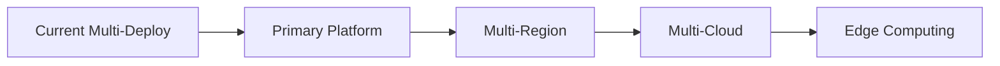

# Virtuoso API Proxy - Strategic Roadmap

## Vision
Transform the Virtuoso test automation platform into an enterprise-ready, multi-cloud API service that simplifies complex testing workflows while providing flexible deployment options across AWS, GCP, and containerized environments.

## Strategic Objectives
1. **Simplification**: Reduce Virtuoso API complexity by 80% for common use cases
2. **Multi-Cloud**: Provide seamless deployment across major cloud providers
3. **Enterprise-Ready**: Production-grade reliability, security, and monitoring
4. **Developer Experience**: Intuitive APIs with comprehensive documentation
5. **Cost Optimization**: Efficient resource utilization across all deployment targets

## Milestones

### Q1 2025: Foundation & Stabilization
- [x] Complete core CLI implementation with 69+ commands
- [x] Establish three deployment architectures (AWS, GCP, Local)
- [x] Implement YAML test definition support
- [ ] **Consolidate deployment strategy** (choose primary platform)
- [ ] **Standardize API contracts** across all deployments
- [ ] **Complete IAM/security setup** for all platforms
- [ ] **Establish monitoring & observability** baseline

### Q2 2025: Production Readiness
- [ ] **Unified API Gateway** with consistent routing
- [ ] **Advanced Authentication**: OAuth2, API key rotation, RBAC
- [ ] **Performance Optimization**: <100ms latency, 99.9% uptime
- [ ] **Comprehensive Test Suite**: 90%+ code coverage
- [ ] **Disaster Recovery**: Multi-region failover capability
- [ ] **Cost Management**: Usage-based billing integration

### Q3 2025: Enterprise Features
- [ ] **Multi-Tenancy**: Isolated environments per organization
- [ ] **Advanced Analytics**: Test insights and trend analysis
- [ ] **Workflow Orchestration**: Complex test pipeline support
- [ ] **Integration Hub**: CI/CD, Slack, Jira, Teams webhooks
- [ ] **Compliance**: SOC2, GDPR, HIPAA readiness
- [ ] **Enterprise SSO**: SAML, OIDC support

### Q4 2025: Innovation & Scale
- [ ] **AI-Powered Features**: Intelligent test generation
- [ ] **GraphQL API**: Flexible query interface
- [ ] **WebSocket Support**: Real-time test execution updates
- [ ] **Global Edge Deployment**: CDN integration
- [ ] **Marketplace**: Test template and plugin ecosystem
- [ ] **Advanced Scheduling**: Cron-based test execution

## Technical Strategy

### Architecture Evolution
```
Current State (Multi-Deployment):
┌─────────┐  ┌─────────┐  ┌─────────┐
│   AWS   │  │   GCP   │  │  Local  │
│  (CDK)  │  │ (Cloud  │  │(FastAPI)│
│         │  │  Run)   │  │         │
└────┬────┘  └────┬────┘  └────┬────┘
     │            │            │
     └────────────┴────────────┘
              Fragmented

Target State (Unified Platform):
┌─────────────────────────────────┐
│    Unified API Gateway Layer    │
├─────────────────────────────────┤
│   Core Business Logic (Shared)  │
├─────────┬──────────┬────────────┤
│   AWS   │   GCP    │  K8s/Edge  │
│ Backend │ Backend  │  Backend   │
└─────────┴──────────┴────────────┘
              Unified
```

### Technology Decisions

#### Primary Platform Selection (Q1 2025)
**Decision Required**: Choose primary deployment platform
- **Option A: GCP-First** ✓ Recommended
  - Pros: Simpler permissions, better free tier, integrated services
  - Cons: Less AWS ecosystem integration
- **Option B: AWS-First**
  - Pros: Market leader, extensive services
  - Cons: Complex IAM, higher initial cost
- **Option C: Container-First (K8s)**
  - Pros: Cloud-agnostic, maximum flexibility
  - Cons: Higher operational complexity

#### API Standardization
- RESTful API with OpenAPI 3.0 specification
- GraphQL layer for complex queries (Q3)
- gRPC for internal service communication
- WebSocket for real-time updates (Q4)

### Performance Targets

| Metric | Current | Q2 2025 | Q4 2025 |
|--------|---------|---------|---------|
| API Latency (p95) | ~500ms | <200ms | <100ms |
| Throughput | 100 RPS | 1,000 RPS | 10,000 RPS |
| Availability | 99% | 99.9% | 99.99% |
| Error Rate | <5% | <1% | <0.1% |

### Security Roadmap

1. **Phase 1 (Current)**: Basic API key authentication
2. **Phase 2 (Q2)**: OAuth2, rate limiting, WAF
3. **Phase 3 (Q3)**: Zero-trust architecture, mTLS
4. **Phase 4 (Q4)**: Advanced threat detection, DLP

## Deployment Strategy

### Progressive Rollout Plan
1. **Stage 1**: Consolidate on primary platform (GCP recommended)
2. **Stage 2**: Add multi-region support
3. **Stage 3**: Implement edge computing capabilities
4. **Stage 4**: Full multi-cloud active-active deployment

### Migration Path


## Success Metrics

### Business KPIs
- Developer adoption rate: 1,000+ active users
- Test execution volume: 1M+ tests/month
- Customer satisfaction: NPS > 50
- Revenue growth: 3x YoY

### Technical KPIs
- Deployment frequency: Daily
- Lead time for changes: <1 hour
- MTTR: <15 minutes
- Change failure rate: <5%

## Risk Mitigation

### Technical Risks
1. **Platform Lock-in**: Mitigate with abstraction layers
2. **Scaling Bottlenecks**: Address with performance testing
3. **Security Vulnerabilities**: Regular audits and updates

### Business Risks
1. **Virtuoso API Changes**: Version compatibility layer
2. **Competition**: Unique value proposition focus
3. **Cost Overruns**: Usage-based pricing model

## Investment Requirements

### Team Structure
- **Q1**: 2 engineers (current)
- **Q2**: +1 DevOps, +1 Frontend
- **Q3**: +2 Backend, +1 Security
- **Q4**: +2 Full-stack, +1 PM

### Infrastructure Budget
- **Q1**: $500/month (development)
- **Q2**: $2,000/month (staging + prod)
- **Q3**: $5,000/month (multi-region)
- **Q4**: $10,000/month (global scale)

## Next Steps

### Immediate Actions (Next 2 Weeks)
1. Complete architectural decision on primary platform
2. Resolve AWS IAM permission issues or pivot to GCP
3. Create unified API specification
4. Set up CI/CD pipeline for chosen platform
5. Implement comprehensive monitoring

### Q1 2025 Deliverables
1. Production deployment on primary platform
2. Complete API documentation
3. Security audit and remediation
4. Performance baseline establishment
5. Customer onboarding process

## Appendix: Technology Radar

### Adopt
- Go for CLI core
- TypeScript for infrastructure
- Kubernetes for orchestration
- Terraform for IaC

### Trial
- Rust for performance-critical paths
- WASM for edge computing
- Dapr for microservices

### Assess
- Temporal for workflow orchestration
- Pulumi as CDK alternative
- Istio for service mesh

### Hold
- Monolithic architectures
- Manual deployments
- Proprietary protocols

---

*This roadmap is a living document and will be updated quarterly based on learnings and market feedback.*