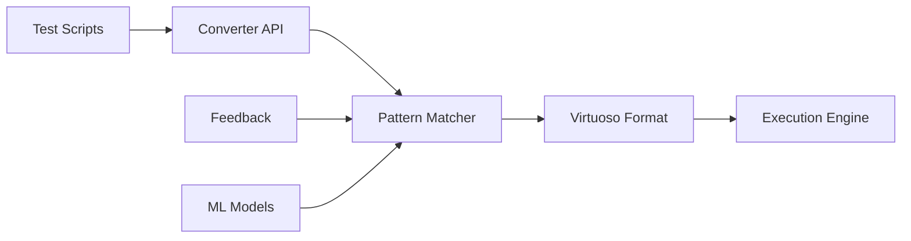

# Virtuoso Test Converter API

Welcome to the Virtuoso Test Converter API documentation! This powerful API enables you to convert test scripts from popular testing frameworks into Virtuoso's format, allowing seamless migration and execution of your existing test suites.

## What is Virtuoso Test Converter?

Virtuoso Test Converter is a comprehensive API service that:

- **Converts** test scripts from Selenium, Cypress, and Playwright to Virtuoso format
- **Analyzes** test patterns and provides confidence scores
- **Executes** converted tests through the Virtuoso platform
- **Learns** from feedback to improve conversion accuracy

## Key Features

### 🔄 Multi-Format Support

Convert tests from multiple popular frameworks:

- **Selenium** (Java, Python, JavaScript, C#)
- **Cypress** (Full command support)
- **Playwright** (Core features)
- **YAML/JSON** test definitions

### 🎯 Intelligent Pattern Recognition

Our API uses advanced pattern matching to:

- Identify common testing patterns across frameworks
- Map framework-specific commands to Virtuoso equivalents
- Provide confidence scores for each conversion
- Suggest alternative approaches when direct mapping isn't possible

### 🚀 Quick Integration

Get up and running in minutes:

- RESTful API with comprehensive documentation
- Multiple SDKs for popular languages
- Webhook support for async processing
- Batch conversion capabilities

### 📊 Continuous Improvement

The system learns and improves:

- Submit feedback on conversions
- Pattern library updates regularly
- Machine learning optimizations
- Community-driven enhancements

## Use Cases

### Test Migration

Migrating from another testing framework? Convert your entire test suite to Virtuoso format while maintaining test coverage and functionality.

### Multi-Framework Teams

Teams using different testing frameworks can standardize on Virtuoso without rewriting tests from scratch.

### Legacy Test Modernization

Breathe new life into legacy test suites by converting them to Virtuoso's modern, AI-powered testing platform.

### Continuous Integration

Integrate test conversion into your CI/CD pipeline for automated test migration and execution.

## Getting Started

Ready to start converting your tests? Here's how:

1. **[Quick Start Guide](./quick-start)** - Get your first test converted in 5 minutes
2. **[API Reference](../api/overview)** - Explore all available endpoints
3. **[Pattern Library](./patterns)** - Browse supported test patterns
4. **[Examples](./developer-guide/conversion-examples)** - See real conversion examples

## Architecture Overview

## Support

Need help? We're here for you:

- 📧 **Email**: support@virtuoso.qa
- 💬 **Discord**: [Join our community](https://discord.gg/virtuoso)
- 📚 **Stack Overflow**: Tag your questions with `virtuoso-converter`
- 🐛 **Issues**: [GitHub Issues](https://github.com/virtuoso/virtuoso-generator/issues)

## What's Next?

- **[Quick Start](./quick-start)** - Convert your first test
- **[Supported Formats](./developer-guide/supported-formats)** - Learn about supported test formats
- **[API Authentication](../api/authentication)** - Set up API access
- **[Pattern Library](./patterns)** - Explore conversion patterns
